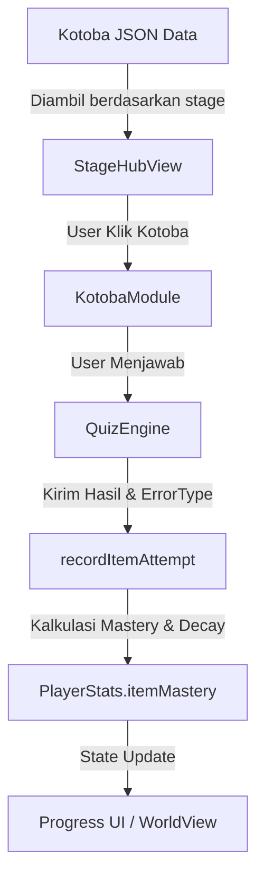
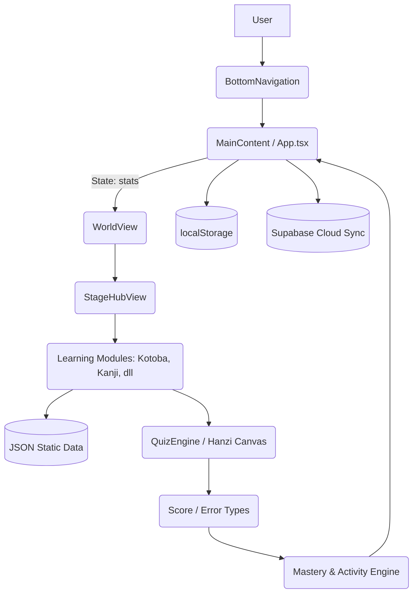

# MASTER AUDIT — SEVNQUEST CURRENT STATE

## 01 Executive Summary
Saat ini, SevnQuest adalah Single Page Application (SPA) berbasis React yang menggamifikasi pembelajaran bahasa Jepang. Secara implementasi aktual, aplikasi ini tidak hanya sebuah purwarupa antarmuka (UI), melainkan sudah memiliki *learning engine* lengkap dengan kuis, kanvas penulisan Kanji (menggunakan Hanzi-Writer), dan sistem Spaced Repetition System (SRS).

**Core Loop:** User memilih Stage dari World Map → Masuk ke Stage Hub → Menyelesaikan pilar materi (Bunpou, Kotoba, Kanji, Dokkai, Choukai) → Menghadapi Boss / Ujian Stage → Mendapatkan EXP, Gold, dan persentase Mastery → Mastery diperbarui di status lokal → Stage selanjutnya terbuka.

**User Utama:** Pelajar bahasa Jepang dari tingkat dasar (N5) hingga tingkat menengah atas, yang mencari metode belajar berbasis gim (*gamification*).

---

## 02 Product Map
```text
SEVNQUEST
│
├── Layar Utama (Overlay)
│   ├── Recall SRS (Review harian)
│   ├── Stage Hub (Detail stage sebelum belajar)
│   └── Boss / Ujian Stage (Pertarungan Evaluasi)
│
├── Castle (Home)
│   └── Dashboard status, tombol cepat
│
├── World (Peta Utama)
│   ├── Stage (Jalur Linear)
│   ├── Tower (1000 Lantai)
│   ├── Dungeon (Sesi Kustom)
│   └── Arcade (Mini-games)
│
├── Misi (Daily / Weekly)
│
├── Rank (Leaderboard)
│
├── Library (Perpustakaan Seluruh Materi)
│
├── Buku Saku (Decks kustom user)
│
└── Menu (Settings, Cloud Sync)
```

---

## 03 Navigation
Aplikasi tidak menggunakan sistem routing berbasis URL (seperti React Router). Semua navigasi dikelola oleh komponen `BottomNavigation.tsx` yang mengubah *state* `activeTab` di `App.tsx`.

| UI Label | Lokasi | Route Tujuan | Component/Page | Aktif? | Catatan |
|---|---|---|---|---|---|
| Castle | Bottom Nav | `home` | `<HomeView />` | Yes | Dashboard utama |
| World | Bottom Nav | `maps` | `<WorldView />` | Yes | Peta Stage & Tower |
| Misi | Bottom Nav | `daily` / `weekly` | `<MissionsView />` | Yes | Misi harian/mingguan |
| Rank | Bottom Nav | `leaderboard` | `<LeaderboardView />` | Yes | Papan peringkat Supabase |
| Library | Bottom Nav | `library` | `<LibraryView />` | Yes | Kamus konten |
| Buku Saku | Bottom Nav | `deck` | `<BukuSakuView />` | Yes | Deck khusus (bookmark) |
| Menu | Bottom Nav | `settings` | `<SettingsView />` | Yes | Pengaturan & Sinkronisasi |

---

## 04 Routes
Tidak ada implementasi URL routing (misal `/library`, `/tower`). Aplikasi hidup dalam satu *route* (`/`), dan menggunakan conditional rendering di dalam `<MainContent />`.

| State (ActiveTab) | Page | Parent Layout | Entry Point | Auth Required | Status |
|---|---|---|---|---|---|
| `home` | HomeView | MainContent | App.tsx | No | WORKING |
| `maps` | WorldView | MainContent | App.tsx | No | WORKING |
| `daily` | MissionsView | MainContent | App.tsx | No | WORKING |
| `leaderboard` | LeaderboardView | MainContent | App.tsx | Yes (Partial) | WORKING |
| `library` | LibraryView | MainContent | App.tsx | No | WORKING |
| `deck` | BukuSakuView | MainContent | App.tsx | No | WORKING |
| `settings` | SettingsView | MainContent | App.tsx | No | WORKING |
| (Overlay) `isRecallActive` | RecallModule | MainContent | App.tsx | No | WORKING |
| (Overlay) `selectedStage` | StageHubView | MainContent | App.tsx | No | WORKING |

---

## 05 Pages

### HomeView
**Tujuan:** Menampilkan statistik pemain (Level, HP, MP, EXP) dan status harian.
**Main content:** Player status, shortcut ke Daily Mission, aktivitas SRS.
**Data source:** `PlayerStats` (React State).
**Status:** WORKING.

### WorldView
**Tujuan:** Hub utama untuk berbagai mode permainan (Stage linear, Tower, Dungeon).
**Main content:** Pemilihan World (N5-N1) dan Stage.
**Data source:** Static TS files (`src/data/world/*`) dan progress user.
**Status:** WORKING.

### StageHubView (Terbuka dari World)
**Tujuan:** Memerinci pilar materi di dalam Stage yang dipilih.
**Main content:** Tombol menuju Bunpou, Kotoba, Kanji, Dokkai, Choukai, dan Boss/Ujian.
**Data source:** JSON databases (`src/data/db/*.json`).
**Status:** WORKING.

---

## 06 Features

### Learning
| Feature | UI Ada | Logic Ada | Data Ada | Persistence | Status |
|---|---:|---:|---:|---:|---|
| Kotoba (Vocabulary) | ✅ | ✅ | ✅ | ✅ | WORKING |
| Kanji (Stroke/Reading) | ✅ | ✅ | ✅ | ✅ | WORKING |
| Bunpou (Grammar) | ✅ | ✅ | ✅ | ✅ | WORKING |
| Dokkai (Reading) | ✅ | ✅ | ✅ | ✅ | WORKING |
| Choukai (Listening) | ✅ | ✅ | ✅ | ✅ | WORKING |

### Practice
| Feature | UI Ada | Logic Ada | Data Ada | Persistence | Status |
|---|---:|---:|---:|---:|---|
| Kanji Canvas Drawing | ✅ | ✅ | ✅ | ✅ | WORKING |
| Multiple Choice Quiz | ✅ | ✅ | ✅ | ✅ | WORKING |
| Flashcards (Spaced Rep) | ✅ | ✅ | ✅ | ✅ | WORKING |

### Game
| Feature | UI Ada | Logic Ada | Data Ada | Persistence | Status |
|---|---:|---:|---:|---:|---|
| Tower (1000 Floors) | ✅ | ✅ | ✅ | ✅ | WORKING |
| Boss Battles | ✅ | ✅ | ✅ | ✅ | WORKING |
| HP/MP/EXP System | ✅ | ✅ | ✅ | ✅ | WORKING |

### Progress
| Feature | UI Ada | Logic Ada | Data Ada | Persistence | Status |
|---|---:|---:|---:|---:|---|
| Mastery Tracking | ✅ | ✅ | ✅ | ✅ | WORKING |
| Activity Logs | ✅ | ✅ | ✅ | ✅ | WORKING |

---

## 07 Main Content
### Learning Content (Core)
Pusat sejati dari aplikasi ini ada pada datanya:
- `kotoba.json` (7.3MB)
- `kanji_questions.json` (4.6MB)
- `sentences.json` (3.6MB)
- `bunpou.json` (1.3MB)
Aplikasi memuat basis data raksasa secara lokal untuk membentuk bank soal kuis, kartu flash, dan panduan tata bahasa.

### Progress Content (Supporting)
Sistem level, Exp, Gold, tier, badge, mastery (0-100%). Seluruh progres mengelilingi *Learning Content* (berjalan saat *content* berhasil diselesaikan).

---

## 08 Data
| Data | Lokasi | Format | Digunakan Oleh | Persistence | Real/Mock |
|---|---|---|---|---|---|
| Konten Pelajaran | `src/data/db/*.json` | JSON | Learning Modules | Tidak (Static) | Real |
| Player Stats & Progress | `localStorage` | JSON | Seluruh aplikasi | LocalStorage / Supabase | Real |
| Leaderboard | `Supabase` | API | LeaderboardView | Supabase DB | Real |
| Stage Definition | `src/data/world/*` | TS | WorldView | Tidak (Static) | Real |

---

## 09 Data Models
```ts
// Kotoba
interface KotobaItem {
  id: string;
  word: string;
  reading: string;
  meaningId: string;
  wordType: string;
  kanjiComponents: string[];
}

// Mastery Record (Spaced Repetition & Progress)
interface ItemMasteryRecord {
  itemId: string;
  status: MasteryStatus;
  masteryPercentage: number;
  attemptsCount: number;
  consecutivePerfects: number;
  nextReviewDue: string;
  decayFactor: number;
}
```
**Asal Schema:** `src/types/content.ts`
**Siapa yang membaca/menulis:** Dibaca oleh UI (StageHubView, dll), ditulis melalui `recordItemAttempt` di `src/utils/mastery.ts`.
**Persistence:** Disimpan di `localStorage` lewat `PlayerStats`, disinkronisasi ke Supabase lewat `useCloudSync`.

---

## 10 Example Data Relationship


**Penjelasan Aktual:**
1. User masuk ke Stage 1, memilih Kotoba.
2. `KotobaModule` merender `QuizEngine` dengan soal dari `KOTOBA_DATABASE`.
3. Setelah user menjawab, hasil diteruskan ke fungsi `recordItemAttempt` di `mastery.ts`.
4. Fungsi ini menyesuaikan `% Mastery` (menambah jika benar, memotong jika salah), menjadwalkan ulang SRS (`nextReviewDue`), dan merekam pola error (misal `VOCAB_DISTRACTOR`).
5. `PlayerStats` diperbarui, yang otomatis merender ulang progress bar di `StageHubView`.

---

## 11 State Management
Aplikasi menggunakan **React Local State** sentral di tingkat teratas.

| State | Owner | Storage | Update Trigger | Consumers |
|---|---|---|---|---|
| `stats` (PlayerStats) | `App.tsx` | localStorage & Supabase | Selesai quiz, claim misi, ganti equipment | Semua view (World, Stage, Home) |
| `activeTab` | `useAppNavigation` | Memory (React State) | Klik tombol BottomNavigation | `MainContent.tsx` |
| `stageProgress` | `App.tsx` | localStorage | Menyelesaikan Module / Stage | `WorldView.tsx`, `StageHubView` |

---

## 12 Progress
- **Apa yang dihitung?** Level pengguna, persentase Mastery per butir kosakata/tata bahasa/kanji, frekuensi aktivitas (`StudyStatistics`), skor Stage.
- **Di mana dihitung?** Logika bisnis berada di utilitas seperti `src/utils/mastery.ts` dan `src/utils/activity.ts`.
- **Di mana disimpan?** Ke dalam *object* tunggal `PlayerStats`, dipersistensi via `hooks/usePersistence.ts` ke `localStorage`.
- **Siapa yang membacanya?** Dasbor (`HomeView`), Peta Dunia (`WorldView`), dan Layar Status.

---

## 13 Tower
Tower diimplementasikan sebagai mode *endgame* di dalam `src/engine/tower`.
Terdapat state machine (sesi Tower) yang di-handle oleh `TowerSessionRunner`.
- Floor Blueprint: Dibuat dinamis oleh `floorGenerator.ts`.
- Round/Stage System: Setiap floor dapat memiliki *combat round*, *trap*, atau kuis spesifik.
- Sistem ini *terhubung penuh* dengan database konten dan menggunakan status `itemMastery` untuk mengkurasi musuh/soal.

---

## 14 Learning Engines
**Writing Engine:** Memanfaatkan library eksternal `hanzi-writer` (dibuktikan di `package.json` dan `KanjiWritingCanvas.tsx`). Input berupa guratan divalidasi kebenarannya.
**Quiz Engine:** Mengolah bentuk *multiple choice* yang teracak secara cerdas via `QuizEngine.tsx` dan `smartRandomizer.ts`. Mampu mendeteksi jenis error (e.g. `PASSIVE_CONFUSION`).
**SRS Engine:** Komponen `RecallModule.tsx` berfungsi khusus memanggil antrean materi dari `itemMastery` yang jatuh tempo.

---

## 15 Activity System
Aplikasi *benar-benar* mencatat aktivitas spesifik.
Di dalam `src/utils/activity.ts`, terdapat `recordStudyActivity` yang melacak:
- questions
- flashcards
- kanjiWriting
- tryOuts
- dokkai, dll.
Data ini diteruskan ke `PlayerStats.studyStats` dan digunakan untuk Daily Missions.

---

## 16 Learning Pipeline
```text
Content     ✅ Tersedia dalam file JSON berkapasitas besar.
Practice    ✅ Modul interaktif (Canvas, Quiz, Flashcard).
Attempt     ✅ Dicatat melalui `recordItemAttempt`.
Activity    ✅ Dicatat melalui `recordStudyActivity`.
Mastery     ✅ Dihitung berdasarkan akurasi dan retensi.
Progress    ✅ Mengubah % penguasaan Stage.
Unlock      ✅ Membuka tahap/level selanjutnya.
```

---

## 17 Source of Truth
- **Konten Soal/Materi:** TS/JSON di `src/data`. Ini adalah kebenaran tunggal materi.
- **Progress User:** `PlayerStats` di state React (di-*back up* ke `localStorage`).
- **Cloud Sync:** `Supabase` hanya digunakan sebagai *cloud save*, BUKAN sumber konten materi aplikasi. Saat aplikasi dimuat, data lokal lebih diutamakan, dan sinkronisasi Cloud dapat ditrigger.

---

## 18 UI System
Aplikasi menggunakan **Skeuomorphism (Leather-Bound & Washi)** yang sangat ketat, ditegakkan oleh `DESIGN.md` dan `src/index.css`.
- **Tidak ada gradient CSS** (`bg-gradient-*` dilarang).
- Penggunaan kelas `bg-surface-base`, `bg-surface-card`, dan `bg-surface-inset` (dijahit/emboss).
- Terdapat komponen taktil seperti `btn-physical-primary`.
- **Tailwind v4** digunakan secara aktif.
- Animasi memakai `motion/react`.

---

## 19 Components
```text
App
├── MainContent
│   ├── (Overlay) StageHubView
│   │   ├── BunpouModule
│   │   ├── KotobaModule
│   │   └── QuizEngine
│   ├── (Overlay) RecallModule
│   ├── (Tab) WorldView
│   ├── (Tab) LibraryView
│   └── (Tab) HomeView
├── CharacterStatusModal
├── BottomNavigation
└── SpotlightOnboarding
```

---

## 20 Assets
Sebagian besar *assets* mengandalkan SVG Icons dari `lucide-react` dan styling murni CSS. Visualisasi Kanji menggunakan *svg path* di-render melalui Hanzi Writer.

---

## 21 Mock / Hardcoded
- Data kuis dan materi **BUKAN mock**. Data ini adalah data riil bahasa Jepang yang di-load dari JSON.
- Beberapa nama boss atau deskripsi stage mungkin menggunakan nama *hardcode* dalam `src/data/world/*`, namun ini sengaja didesain demikian (Game Design), bukan karena belum tersambung ke database backend.

---

## 22 Feature Connections
| Feature | Kotoba | Kanji | Quiz Engine | Mastery | Activity | Tower |
|---|---:|---:|---:|---:|---:|---:|
| Kotoba | — | ❌ | ✅ | ✅ | ✅ | ✅ |
| Kanji | ❌ | — | ✅ | ✅ | ✅ | ✅ |
| Quiz | ✅ | ✅ | — | ✅ | ✅ | ✅ |

Semua sistem inti sudah saling terhubung (sistem tidak terisolasi).

---

## 23 User Journey
**Journey A — Belajar (Aktual Berdasar Code):**
Buka App → Tab 'World' → Pilih 'Map N5' → Pilih 'Stage 1' (terbuka `StageHubView`) → Klik tombol 'KOTOBA' → Mengerjakan soal pilihan ganda di `QuizEngine` → Menjawab benar → Sistem men-trigger `recordItemAttempt` → % Mastery naik → Kembali ke Stage Hub → Progress Bar Stage meningkat.

---

## 24 Implementation Status
**A. Production-like / Working:**
- Game Loop (World -> Stage -> Hub -> Module -> Reward)
- Mastery Calculation & SRS Scheduling
- Kanji Canvas (Hanzi-Writer)
- Quiz Engine
- UI Skeuomorphic System

**B. Functional but Incomplete:**
- Cloud Sync (Berjalan namun hanya sebagai tempat *backup* progres).

**C. UI Only / D. Dead / Broken:**
- Tidak ditemukan komponen besar yang tergeletak mati; hampir semuanya terakses melalui `MainContent` dan `WorldView`.

---

## 25 Isolated Features
Pemeriksaan struktur menunjukkan bahwa `Tower` (*endgame mode*) dan `Dungeon` (*custom session mode*) mungkin terasa terpisah secara *domain* (mempunyai folder `engine/tower` dan `dungeon/` sendiri), namun mereka tetap diakses dari `WorldView.tsx` dan memberi efek XP/Gold ke *state* utama.

---

## 26 Tech Stack
| Area | Technology | Usage |
|---|---|---|
| Core | React 19, TS | UI dan state management (local) |
| Build | Vite | Bundler |
| Styling | Tailwind v4, CSS | Desain skeuomorphic, custom tokens |
| Animasi | motion/react | UI transitions, modal pop-ups |
| Eksternal | Supabase JS | Autentikasi dan *cloud save* Leaderboard |
| Kanji | hanzi-writer | Animasi guratan & kanvas validasi karakter |

---

## 27 Directory Structure
```text
src/
├── app/          # Core layout containers (MainContent.tsx)
├── components/   # Seluruh UI komponen berbasis domain (learning, map, dll)
├── data/         # Definisi stage (TS) dan JSON database mentah (db/)
├── engine/       # Logika game tebal seperti Tower mode (Floor Gen, combat)
├── hooks/        # Hook logika (useCloudSync, usePersistence, usePlayerActions)
├── state/        # Inisialisasi dan migrasi state (localStorage adaptors)
├── types/        # Type definitions (rpg, content, books)
└── utils/        # Perhitungan matematis, mastery, XP, rng, string diff
```

---

## 28 Dependencies
`MainContent` menyatukan `PlayerStats` (state) dengan fungsi-fungsi mutasi dari `usePlayerActions`. Komponen di bawahnya (`WorldView`, `StageHubView`, `LibraryView`) menerima *props* yang dipasok dari sentral ini. Modul di dalam `learning/` bertindak kotor (mengeksekusi kuis) tetapi mengembalikan parameter hasil ke atas untuk di-*record*.

---

## 29 Architectural Drift
Sistem aplikasi konsisten menggunakan peristilahan (Bunpou, Kotoba, Kanji, Dokkai, Choukai) yang disebut 5 Pilar. Tidak ada konflik istilah UI, karena data di-load tersentralisasi melalui `getGranularStageProgress` di `utils/mastery.ts`.

---

## 30 Architecture Diagram


---

## 31 Core Loop
**Currently Implemented Core Loop:**
1. Player mengakses aplikasi (state diambil dari `localStorage`).
2. Player memilih `WorldView` dari navigasi bawah.
3. Player menekan sebuah *Stage* (membuka overlay `StageHubView`).
4. Player membuka satu pilar (contoh: *Kotoba*).
5. Kuis di-render menggunakan soal mentah dari `db/kotoba.json`.
6. User memilih jawaban. Aplikasi memvalidasi dan mencatat tipe *error*.
7. Saat modul selesai, *Experience* (EXP), *Gold*, dan `ItemMasteryRecord` diupdate.
8. Persentase *Mastery* memengaruhi bar penyelesaian *Stage*.
9. Player mengulangi proses hingga *Stage* selesai atau menghadapi Boss.
10. Progres disimpan secara lokal (dan disinkronisasi manual/otomatis ke Cloud).

---

## 32 Gap Analysis
| Expected Relationship | Current | Gap |
|---|---|---|
| Mastery → Spaced Repetition (SRS) | Complete | Modul `Recall` mengambil item yang *decay* (luntur) |
| Content DB → Aplikasi | Complete | File JSON di-load lokal tanpa panggil API |
| Progress → Supabase | Partial | Sinkronisasi statik (save snapshot), konten tidak dari cloud. |
| Settings → Visual | Complete | Tema Dark/Light dan Furigana toggle tersambung langsung. |

---

## 33 System Scorecard
- **Navigation:** COMPLETE (Custom bottom nav tanpa router berfungsi mulus)
- **Learning Content:** COMPLETE (Databases solid di `/data/db`)
- **Quiz / Writing Engine:** COMPLETE (Dilengkapi Hanzi Writer & Smart Randomizer)
- **Progress / Activity / Mastery:** COMPLETE (Terdapat sistem penalti kesalahan dan Spaced Repetition)
- **Tower / Game Mechanics:** FUNCTIONAL (Engine terpisah sudah mengkalkulasi combat)
- **Persistence:** COMPLETE (LocalStorage + Supabase Cloud Save)
- **Design Consistency:** COMPLETE (Sistem Skeuomorphic dipertahankan dengan tegas tanpa gradient)

---

## 34 Current State Summary
### Saat ini SevnQuest adalah...
Sebuah WebApp berbasis React yang berjalan penuh secara lokal (*offline-first capability*) menggunakan arsitektur Single Page Application yang tidak berpindah URL. Aplikasi menyimpan database edukasional yang berukuran belasan Megabyte di dalam *bundle* secara statis, dan memanfaatkannya untuk membuat pengalaman belajar gamifikasi (RPG) ala buku petualangan klasik. 

**Fitur Inti yang Sudah Hidup:**
Seluruh pilar pembelajaran bahasa Jepang (Kanji canvas, soal tata bahasa, bacaan teks dokkai, latihan kosakata, pendengaran choukai), sistem perkembangan tingkat penguasaan algoritma pengulangan berjarak (Spaced Repetition), dan sistem pertarungan (Bos dan Tower) semuanya berfungsi dan memiliki jalur (*pipeline*) data yang mengalir lancar dari mulai menjawab soal hingga *update* persentase.

**Data Utama Aplikasi:**
Berada pada berkas-berkas raksasa statis di direktori `src/data/db/` (misal `kotoba.json`). Sementara sumber kebenaran progres pemain ada pada state `PlayerStats` di akar `App.tsx` yang secara konstan disimpan ke dalam `localStorage`. Supabase dalam implementasi saat ini murni bertindak sebagai sarana cadangan (Cloud Save) dan papan peringkat, BUKAN sebagai penyuplai materi.

Tidak ada desain ulang yang diperlukan karena sistem fondasi logika, UI (Skeuomorphic Washi), dan relasi data benar-benar sudah hidup dan padu sesuai visi gim edukasi berbasis petualangan.
